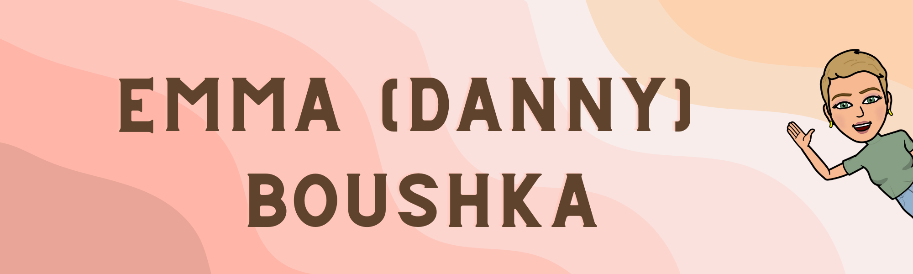

✨Hello there! My name is Emma, although my friends call me Danny. I'm currently enrolled in a Fullstack Web Development Bootcamp through UT Austin. I'm passionate about learning and collaborating with new and experienced web developers to create exciting and innovative projects. As someone who loves to connect and collaborate with others, I'm always eager to meet and learn from like-minded individuals within the world of web development. I invite you to check out my repositories, where you'll find personal and collaborative projects (many of which have names inspired by my personal LEGO collection!) that showcase my skills and interests. Please feel free to share your thoughts, feedback, or ideas. Thank you for taking the time to visit my profile, and I look forward to connecting with you soon!✨

<!--
**boushka9/boushka9** is a ✨ _special_ ✨ repository because its `README.md` (this file) appears on your GitHub profile.

Here are some ideas to get you started:

- 🔭 I’m currently working on ...
- 🌱 I’m currently learning ...
- 👯 I’m looking to collaborate on ...
- 🤔 I’m looking for help with ...
- 💬 Ask me about ...
- 📫 How to reach me: ...
- 😄 Pronouns: ...
- ⚡ Fun fact: ...
-->
